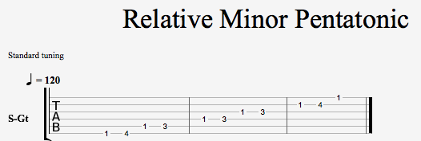
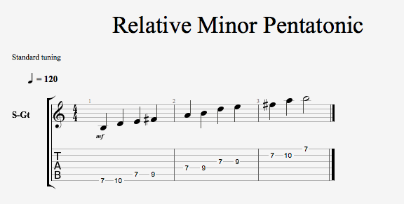

# The Minor Pentatonic Scale

<!-- ## About the major scale -->
<!-- TODO(rthakker) Add general information about the major scale -->

### Relative Fret Positions

Root Note: Lowest String 2nd relative position.

### B Minor Pentatonic Scale

